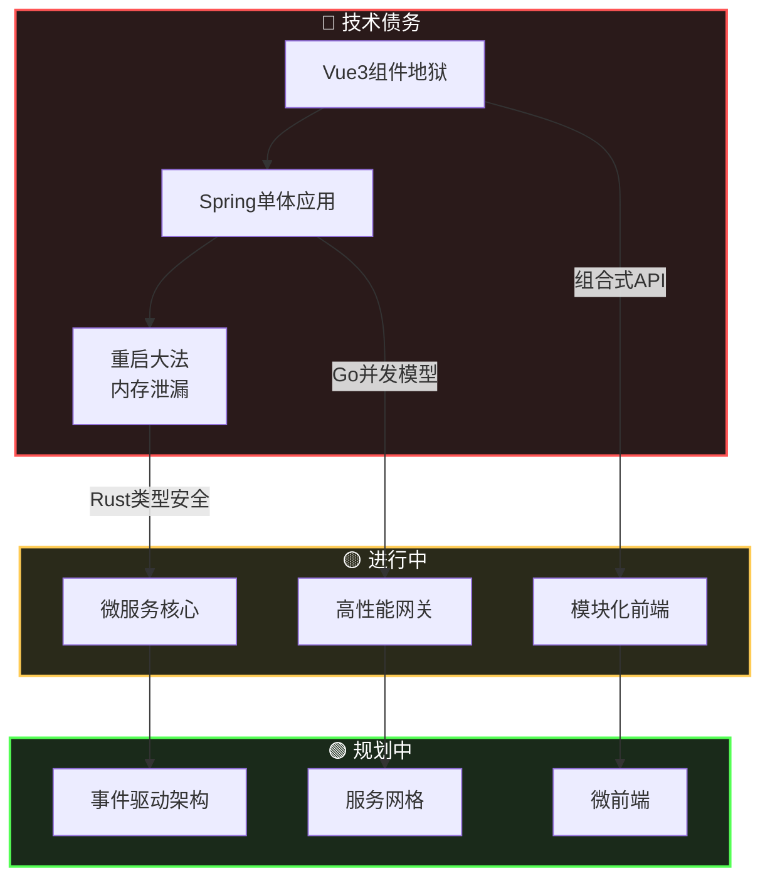

<div align="center">

# 👋 你好，世界！

</div>

<div>
    
## 💻 **source_code.rs**

```rust
#[derive(Debug, Clone)]
struct 架构师简介 {
    id: &'static str,
    角色: 角色,
    状态: 状态,
    使命: &'static str,
}

#[derive(Debug, Clone)]
enum 角色 {
    NuclearWasteDev,   // ☢️ 核废料开发者（遗留系统）
    ArchitectReserve,  // 🏗️ 架构师预备役（目标）
}

#[derive(Debug, Clone)]
enum 状态 {
    重构中 {
        来自: &'static str,
        目标: &'static str,
        方法: 策略,
    },
    重构,
    调试,
}

#[derive(Debug, Clone)]
enum 策略 {
    DDD,           // 领域驱动设计
    CQRS,          // 命令查询职责分离
    EventSourcing, // 事件溯源
}

impl 架构师简介 {
    fn 新建() -> Self {
        架构师简介 {
            id: "GuLuGuLu3399",
            角色: 角色::ArchitectReserve,
            状态: 状态::重构中 {
                来自: "意面代码 (Vue3/Java)",
                目标: "整洁架构 (Rust/Go)",
                方法: 策略::DDD,
            },
            使命: "在紫荆桥下写的BUG，终将成为勋章",
        }
    }
}
```

---

## 🎨 **技术栈**

<p align="center">
  
</p>

---

## 🚧 **重构路线图**



---

## 📦 **项目清单**

| 项目 | 技术栈 | 状态 | 描述 |
|------|--------|------|------|
| **Bifrost CMS** | Rust • Go • gRPC | 🟢 活跃 | 高性能无头内容管理系统 |
| **Web-Work** | Vue3 • TS • Go | 🟡 开发中 | 全栈学习平台 |
| **个人博客** | Tauri • Vue3 • Rust | 🟢 维护中 | 跨平台桌面博客应用 |
| **畜牧管理系统** | Java • Spring Boot | 🔵 遗留 | 畜牧业智能管理系统 |

---

## 📊 **GitHub统计**

<div align="center">
  
  
</div>

---

## 🎯 **当前状态**

<p align="center">
🔭 <b>正在架构:</b> Bifrost CMS（基于Rust/Go的微服务）<br/>
🌱 <b>正在学习:</b> 数据库内核与分布式系统<br/>
💬 <b>可以问我:</b> 后端架构、Rust、Go、Vue3<br/>
⚡ <b>趣闻:</b> 可以在凌晨3点不喝咖啡调试生产问题
</p>

---

## 🌐 **联系我**

<p align="center">
  <a href="https://github.com/GuLuGuLu3399">
    
  </a>
  <a href="https://twitter.com/yourusername">
    
  </a>
  <a href="https://www.linkedin.com/in/yourusername">
    
  </a>
  <a href="mailto:your-email@example.com">
    
  </a>
</p>

---

<p align="center">
  <i>"代码是写给人看的，机器只是顺便执行而已。"</i>
</p>

</div>
