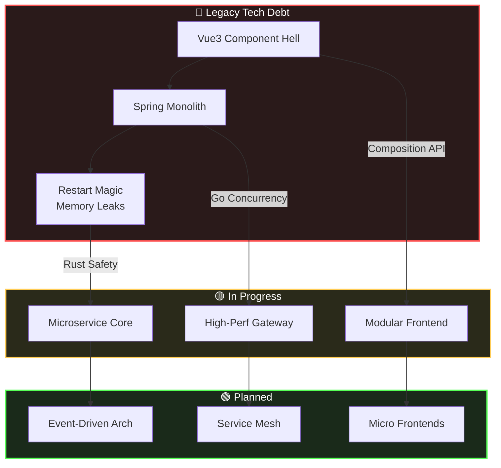

<div align="center">

# 👋 Hello, World!

---

## 💻 **source_code.rs**

```rust
#[derive(Debug, Clone)]
struct ArchitectProfile {
    id: &'static str,
    role: Role,
    state: State,
    mission: &'static str,
}

#[derive(Debug, Clone)]
enum Role {
    NuclearWasteDev,   // ☢️ Nuclear Waste Dev (Legacy)
    ArchitectReserve,  // 🏗️ Architecture Reserve (Target)
}

#[derive(Debug, Clone)]
enum State {
    Transmuting {
        from: &'static str,
        to: &'static str,
        method: Strategy,
    },
    Refactoring,
    Debugging,
}

#[derive(Debug, Clone)]
enum Strategy {
    DDD,           // Domain-Driven Design
    CQRS,          // Command Query Responsibility Segregation
    EventSourcing, // Event Sourcing
}

impl ArchitectProfile {
    fn new() -> Self {
        ArchitectProfile {
            id: "GuLuGuLu3399",
            role: Role::ArchitectReserve,
            state: State::Transmuting {
                from: "Spaghetti Code (Vue3/Java)",
                to: "Clean Architecture (Rust/Go)",
                method: Strategy::DDD,
            },
            mission: "The bugs I wrote under the purple banyan tree will eventually become medals",
        }
    }
}
```

---

## 🎨 **tech_palette.rgb**

<p align="center">
  
</p>

---

## 🚧 **refactor_roadmap.mmd**



---

## 📦 **project_manifest.json**

| Project | Tech Stack | Status | Description |
|---------|------------|--------|-------------|
| **Bifrost CMS** | Rust • Go • gRPC | 🟢 Active | High-performance headless CMS |
| **Web-Work** | Vue3 • TS • Go | 🟡 Developing | Full-stack learning platform |
| **Personal Blog** | Tauri • Vue3 • Rust | 🟢 Maintained | Cross-platform desktop blog |
| **Animal Husbandry** | Java • Spring Boot | 🔵 Legacy | Livestock management system |

---

## 📊 **git_stats.log**

<div align="center">
  
  
</div>

---

## 🎯 **status_check.ini**

<p align="center">
🔭 <b>Architecting:</b> Bifrost CMS (Microservices with Rust/Go)<br/>
🌱 <b>Learning:</b> Database internals & Distributed systems<br/>
💬 <b>Ask me about:</b> Backend architecture, Rust, Go, Vue3<br/>
⚡ <b>Fun fact:</b> Can debug production issues at 3 AM without coffee
</p>

---

## 🌐 **Connect With Me**

<p align="center">
  <a href="https://github.com/GuLuGuLu3399">
    
  </a>
  <a href="https://twitter.com/yourusername">
    
  </a>
  <a href="https://www.linkedin.com/in/yourusername">
    
  </a>
  <a href="mailto:your-email@example.com">
    
  </a>
</p>

---

<p align="center">
  <i>"Code is written for humans to read, machines just happen to execute it."</i>
</p>

</div>
