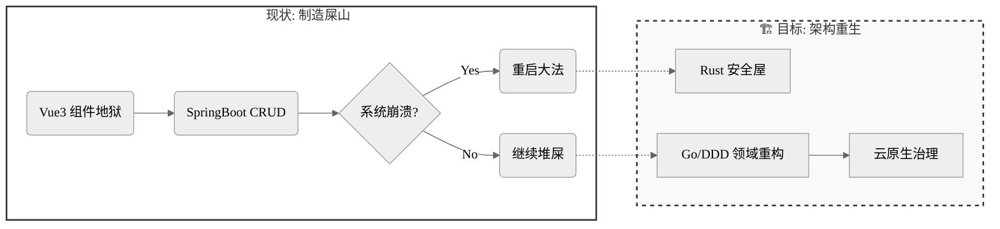

<div align="center">

# `Hello, World!`

</a>

<a href="[https://www.hyh0209.cn](https://www.google.com/search?q=https://www.hyh0209.cn)"></a>
<a href="mailto:Y2433936387@163.com"></a>
<a href="[https://github.com/GuLuGuLu3399](https://github.com/GuLuGuLu3399)"></a>

</div>

## 💻 `User.profile`

```rust
// 😈 华农 IMIS 核废料级程序员 · 架构师（预备役）
struct ArchitectProfile {
    name: String,
    university: String,
    role: Role,
    current_state: State,
    motto: String,
}

enum Role {
    NuclearWasteDev,    // 核废料级程序员
    RefactorSpecialist, // 屎山重构专家
    ArchitectReserve,   // 架构师预备役
}

fn main() {
    let me = ArchitectProfile {
        name: "GuLuGuLu3399".to_string(),
        university: "IMIS / SCAU".to_string(),
        role: Role::ArchitectReserve,
        
        // 正在将技术债务证券化...
        current_state: State::Transmuting {
            from: "Spaghetti Code (屎山)",
            to: "Microservices (微服务)",
            using: vec!["DDD", "Go (Orchestration)", "Rust (Compute)", "K8s"]
        },
        
        motto: "在紫荆桥下写的 bug，终将成为架构师勋章".to_string(),
    };

    println!("Loading Architecture... {:?}% Complete", 3.14);
}

```

## 🛠️ `Tech.stack`

<div align="center">

**Core & Backend**


**Frontend & Visual**


**Infra & Data**


</div>

## 🚧 `Refactor.roadmap`



## 📦 `Project.manifest`

> “从紫荆桥下的 bug 猎人，到架构师——我们终将把技术负债变成架构资本”

| Project | Tech Stack | Status / Description |
| --- | --- | --- |
| **Bifrost CMS v3.2** | `Go`, `Rust`, `gRPC` | **Planning (Pure Edition)**<br>

<br>采用 Go 处理业务编排，Rust 负责高性能计算 (Markdown/Index) 的模块化单体架构。 |
| **Animal Husbandry System** | `Java`, `Spring Boot` | **Refactoring**<br>

<br>广东省畜牧业生产数据管理系统。深度技术分析与文档化治理，消除祖传技术债。 |
| **Personal Blog** | `Gin`, `Tauri`, `Vue3` | **Stable**<br>

<br>跨端尝试，每次更新都是一次小型重构。 |
| **IMISLab** | `Vue3`, `TS` | **Active**<br>

<br>功能虽臃肿，但比以前的机器人项目更靠谱。 |

<details>
<summary><b>🧪 点击展开：技术毒物分析报告 (Legacy Data)</b></summary>


| 毒物 | 毒性描述 | 解毒方案（架构师方向） |
| --- | --- | --- |
| **Vue3+TS** | 组件地狱深度患者 | `微前端架构` · `WebGL可视化` |
| **SpringBoot** | 祖传CRUD战士 | `分布式事务` · `JVM调优` |
| **Gin** | 高并发从入门到放弃 | `万级QPS优化` · `中间件生态` |
| **Python** | import拯救世界 | `Flink实时计算` · `架构健康诊断` |
| **Rust** | 编译器一生之敌 | `内存安全实战` · `异步编程` |

</details>

---

<div align="center">
<p align="center">

</p>
<sub style="color: gray">Debug Success. System Halted.</sub>
</div>
