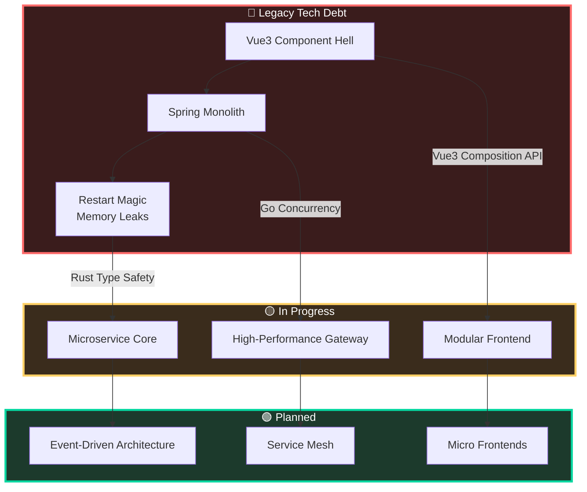

<div align="center">

# 👋 Hello, World!

</div>

<div>
    
## 💻 **Profile.rs**

```rust
#[derive(Debug, Clone)]
struct ArchitectProfile {
    id: &'static str,
    role: Role,
    state: State,
    mission: &'static str,
}

#[derive(Debug, Clone)]
enum Role {
    /// ☢️ Nuclear Waste Developer
    NuclearWasteDev,
    /// 🏗️ Architecture Reserve
    ArchitectReserve,
}

#[derive(Debug, Clone)]
enum State {
    Transmuting {
        from: &'static str,
        to: &'static str,
        method: Strategy,
    },
    Refactoring,
    Debugging,
}

#[derive(Debug, Clone)]
enum Strategy {
    DDD,    // Domain-Driven Design
    CQRS,   // Command Query Responsibility Segregation
    EventSourcing,
}

impl ArchitectProfile {
    fn new() -> Self {
        ArchitectProfile {
            id: "GuLuGuLu3399",
            role: Role::ArchitectReserve,
            state: State::Transmuting {
                from: "Spaghetti Code (Vue3/Java)",
                to: "Clean Architecture (Rust/Go)",
                method: Strategy::DDD,
            },
            mission: "The bugs I wrote under the purple banyan tree will eventually become medals",
        }
    }
}
```

---

## 🎨 **Tech Stack**

<p align="center">
  
</p>

---

## 🚧 **Refactor Roadmap**



---

## 📦 **Active Projects**

| Project | Tech Stack | Status | Description |
|---------|------------|--------|-------------|
| **Bifrost CMS** | Rust • Go • gRPC • PostgreSQL | 🟢 Active | High-performance headless CMS with microservices |
| **Web-Work** | Vue3 • TypeScript • Go • Gin | 🟡 Developing | Full-stack learning platform with algorithm visualization |
| **Personal Blog** | Tauri • Vue3 • Rust | 🟢 Maintained | Cross-platform desktop blog application |
| **Animal Husbandry** | Java • Spring Boot • MySQL | 🔵 Legacy | Intelligent livestock management system |

---

## 📊 **GitHub Stats**

<div align="center">
  <picture>
    <source media="(prefers-color-scheme: dark)" srcset="https://github-readme-stats.vercel.app/api?username=GuLuGuLu3399&show_icons=true&theme=dark&hide_border=true&count_private=true&include_all_commits=true&bg_color=00000000">
    
  </picture>

  <picture>
    <source media="(prefers-color-scheme: dark)" srcset="https://github-readme-stats.vercel.app/api/top-langs/?username=GuLuGuLu3399&layout=compact&theme=dark&hide_border=true&langs_count=8&bg_color=00000000&exclude_repo=GuLuGuLu3399.github.io">
    
  </picture>
</div>

---

## 🎯 **Currently Focused On**

- 🔭 **Architecting** Bifrost CMS (Microservices with Rust/Go)
- 🌱 **Learning** Database internals & Distributed systems
- 👯 **Looking to collaborate on** Open-source infrastructure projects
- 💬 **Ask me about** Backend architecture, Rust, Go, Vue3
- 📫 **How to reach me**: mailto:your-email@example.com | https://blog.example.com
- ⚡ **Fun fact**: Can debug production issues at 3 AM without coffee

---

## 📫 **Connect With Me**

<p align="center">
  <a href="https://github.com/GuLuGuLu3399" target="_blank">
    
  </a>
  <a href="https://twitter.com/yourusername" target="_blank">
    
  </a>
  <a href="https://www.linkedin.com/in/yourusername" target="_blank">
    
  </a>
  <a href="https://blog.example.com" target="_blank">
    
  </a>
</p>

---
<div>
<p align="center">
  <i>"Code is written for humans to read, machines just happen to execute it."</i>
</p>
</div>
