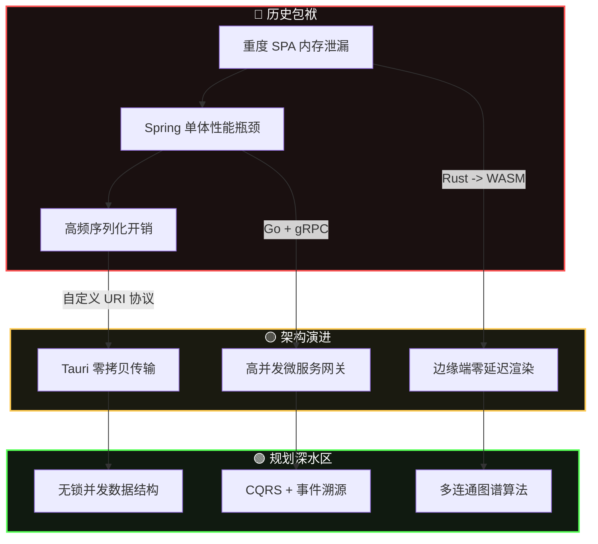

## 💻 **source_code.rs**

```rust
#[derive(Debug, Clone)]
struct 架构师简介 {
    id: &'static str,
    角色: 角色,
    状态: 状态,
    使命: &'static str,
}

#[derive(Debug, Clone)]
enum 角色 {
    FullStackExplorer, // 🌍 全栈探索者 (业务落地)
    ArchitectReserve,  // 🏗️ 架构师预备役 (底层基建)
}

#[derive(Debug, Clone)]
enum 状态 {
    进化中 {
        来自: &'static str,
        目标: &'static str,
        核心理念: 策略,
    },
    重构,
    调试,
}

#[derive(Debug, Clone)]
enum 策略 {
    Polyglot,      // 多语言异构 (Go/Rust 协同)
    CQRS,          // 命令查询职责分离
    ZeroCopy,      // 零拷贝与极致性能
}

impl 架构师简介 {
    fn 新建() -> Self {
        架构师简介 {
            id: "GuLuGuLu3399",
            角色: 角色::ArchitectReserve,
            状态: 状态::进化中 {
                来自: "传统单体与前端组件地狱 (Java/Vue3)",
                目标: "高性能跨平台与微服务 (Rust/Go/Tauri)",
                核心理念: 策略::Polyglot,
            },
            使命: "构建高性能系统与极致交互，消除一切不必要的 I/O",
        }
    }
}
```

---

## 🎨 **技术栈**

<p align="center">
  
</p>

---

## 🚧 **架构演进路线图**


```mermaid
flowchart TD
    subgraph 技术债务[🔴 历史包袱]
        direction LR
        A[重度 SPA 内存泄漏] --> B[Spring 单体性能瓶颈]
        B --> C[高频序列化开销]
    end
    
    subgraph 核心重构[🟡 架构演进]
        direction LR
        C -->|自定义 URI 协议| D[Tauri 零拷贝传输]
        B -->|Go + gRPC| E[高并发微服务网关]
        A -->|Rust -> WASM| F[边缘端零延迟渲染]
    end
    
    subgraph 探索前沿[🟢 规划深水区]
        direction LR
        D --> G[无锁并发数据结构]
        E --> H[CQRS + 事件溯源]
        F --> I[多连通图谱算法]
    end
    
    style 技术债务 fill:#1a1010,stroke:#ff5555,stroke-width:2px,color:#fff
    style 核心重构 fill:#1a1a10,stroke:#ffcc55,stroke-width:2px,color:#fff
    style 探索前沿 fill:#101a10,stroke:#55ff55,stroke-width:2px,color:#fff
```

---

## 📦 **核心引擎与架构**

| 项目 | 技术栈 | 定位 | 核心技术点 |
|------|--------|------|------|
| **Yuhaku (余白)** | Tauri • Rust • Vue3 | 🥇 跨平台端侧引擎 | `yuhaku://` 零拷贝协议, JNI 流式导入, 内存隔离 |
| **Bifrost** | Go • Rust • Nuxt 4 | 🚀 微服务聚合平台 | Polyglot 架构 (Go+Rust), CQRS 落地, NATS 事件驱动 |
| **Memory Stream** | Vue3 • Rust • WASM • Go | 🧠 知识图谱系统 | Rust→WASM 边缘渲染, WebSocket 实时协议, 有向图算法 |
| **CodeForge** | Vue3 • Go • Judge0 | 🧱 复杂全栈基础设施 | OJ 判题沙箱隔离, 交互式算法可视化, 21个 Composable 架构 |

---

## 📊 **GitHub 统计**

<div align="center">
  
  
</div>

---

## 🎯 **当前状态**

<p align="center">
🔭 <b>正在架构:</b> 跨平台端侧应用与异构微服务网络<br/>
🌱 <b>深入探索:</b> WASM 边缘计算、Rust 内存安全与无锁并发<br/>
💬 <b>可以问我:</b> Go 微服务调优、Tauri 跨平台踩坑、前端性能极限榨取<br/>
⚡ <b>状态:</b> 可以在凌晨 3 点看着 Dashboard 上的 P99 延迟降到 10ms 以内
</p>

---

## 🌐 **联系网络**

<p align="center">
  <a href="https://github.com/GuLuGuLu3399">
    
  </a>
  <a href="mailto:your-email@example.com">
    
  </a>
</p>
```
