<div align="center">

# `Hello, World!`

<a href="[https://git.io/typing-svg](https://git.io/typing-svg)">

</a>

<a href="[https://www.hyh0209.cn](https://www.hyh0209.cn)">

</a>
<a href="mailto:Y2433936387@163.com">

</a>
<a href="[https://github.com/GuLuGuLu3399](https://github.com/GuLuGuLu3399)">

</a>

</div>

<h3 align="center">💻 <code>source_code.rs</code></h3>

```rust
// 😈 核心身份定义：化技术负债为资产
struct ArchitectProfile {
    id: String,
    role: Role,
    state: State,
    mission: String,
}

enum Role {
    NuclearWasteDev,    // ☢️ 核废料制造者
    ArchitectReserve,   // 🏗️ 架构师预备役
}

fn main() {
    let me = ArchitectProfile {
        id: "GuLuGuLu3399".to_string(),
        role: Role::ArchitectReserve,
        
        // 🚀 正在进行的熵减过程
        state: State::Transmuting {
            from: "Spaghetti Code (Vue3/Java)",
            to: "Clean Architecture (Rust/Go)",
            method: Strategy::DDD_CQRS
        },
        
        mission: "在紫荆桥下写的 BUG，终将成为勋章".to_string(),
    };
}

```

<h3 align="center">🎨 <code>tech_palette.rgb</code></h3>

<div align="center">


</div>

<h3 align="center">🚧 <code>refactor_graph.mmd</code></h3>



<h3 align="center">📦 <code>project_manifest.json</code></h3>

<div align="center">

```mermaid
%%{init: {'theme': 'base', 'themeVariables': { 'primaryColor': '#ff0000', 'edgeLabelBackground':'#fff', 'tertiaryColor': '#fff'}}}%%
graph LR
    subgraph LEGACY [🔴 负债区 ]
        A(Vue3 组件地狱) --> B(SpringBoot CRUD)
        B -.->|崩溃| C(重启大法)
    end

    subgraph FUTURE [🟢 重构区 ]
        C ==>|Rust 内存安全| D[微服务核心]
        B ==>|Go 业务编排| E[高并发网关]
    end

    style LEGACY fill:#ffe6e6,stroke:#ff0000,stroke-width:2px
    style FUTURE fill:#e6ffec,stroke:#00ff00,stroke-width:2px

```

| PROJECT | TECH STACK | STATUS |
| --- | --- | --- |
| **Bifrost CMS v3.2** | `Go` `Rust` `gRPC` |  |
| **Animal Husbandry** | `Java` `Spring Boot` |  |
| **Personal Blog** | `Gin` `Tauri` `Vue3` |  |

</div>

<div align="center">

</div>
